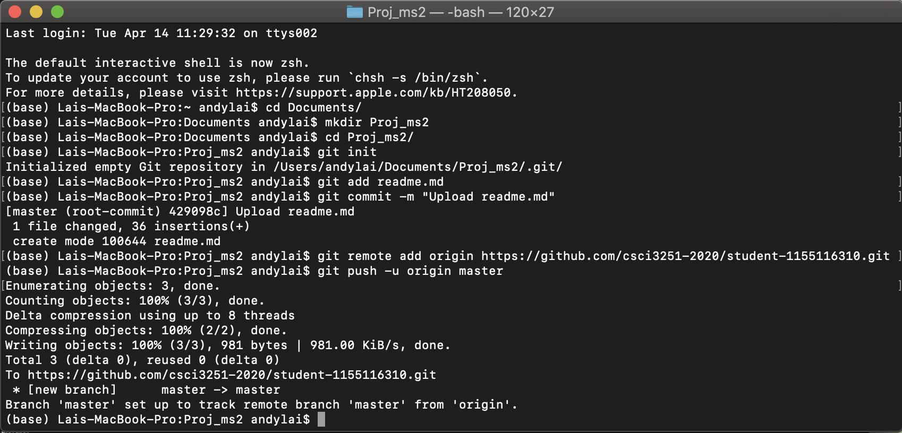

# Self Introduction
Hi. I am __Lai Jian Shin__ and I am a year 2 Computer Science student from __Brunei__!

## My experiences
As a developer, I have done the following:
- Mini-game development (Coded the game Pong on VB.NET)
- Web development
- Python scripting on a Raspberry Pi
- Android Kernel hacking (under the name SkyMelon)
- Bash scripting for certain automation

## Github
I have played with Github for some time, but only covered the basics. Learnt a lot during this academic term! :)

## Wish List during quarantine lockdown
- [ ] Finish off the few web projects I've never touched since February
- [x] Stay in close contact with closest friends :)
- [x] Sleeping late
- [x] Taking 2-3x more longer to do what used to only require like maybe an hour or so
- [x] Zoom for not only lecture (movie - screen and audio sharing is a God-send)
- [ ] Waking up early

## My most memorable courses
These are the courses that will always have a special place in my heart. Not because they were easy or anything - they just had a lot of memories attached to them. Noticed how most of em' were year 1 courses, they were very very memorable and was a fresh and new exciting experience overall
Course Code | Course Title
----------- | ------------
ENGG1100 | Intro to Engineering Design
ENGG1110 | Problem Solving by Programming
MATH1510 | Calculus for Engineers
PHYS1110 | Engineering Physics: Mechanics & Thermodynamics
ENGG1410 | Linear Algebra & Vector Calculus
ENGG2020 | Digital Logic & Systems
ELTU2014 | English for Engineering Students I
CSCI2040 | Introduction to Python

## Screenshot

